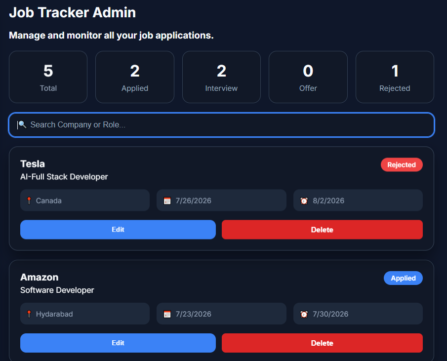
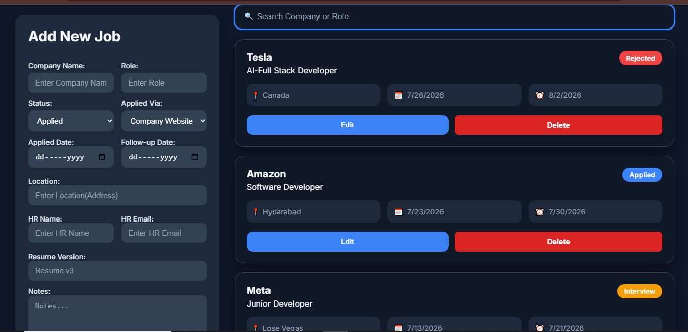

# 🚀 Job Application Tracker

A full-stack **MERN Stack** application that helps job seekers organize, manage, and track every job application in one place. Instead of maintaining spreadsheets or notes, users can monitor application progress, schedule follow-ups, and manage their complete job search professionally.

---

## 🌐 Live Demo:
```bash
https://job-application-tracker-mocha-alpha.vercel.app/
```
---

# 📸 Preview

> Add screenshots inside a **docs/** folder and update the paths below.


| Dashboard                        | Add Job                      |
| -------------------------------- | ---------------------------- |
|           |  |

---

# ✨ Features

### 📋 Job Management

* Add new job applications
* Edit existing applications
* Delete applications with confirmation modal
* Store company information
* Store HR details
* Track resume versions
* Add personal notes

---

### 📊 Dashboard

* Total Applications
* Applied Jobs
* Interview Jobs
* Offer Jobs
* Rejected Jobs

Each statistics card is clickable and filters the dashboard instantly.

---

### 🔍 Search & Filtering

* Search by Company Name
* Search by Job Role
* Filter jobs by Status
* Dynamic Dashboard updates

---

### 📅 Application Tracking

Track important information such as:

* Applied Date
* Follow-up Date
* Company Location
* HR Name
* HR Email
* Resume Version
* Notes

---

### 🎨 User Experience

* Modern Dark Theme
* Responsive Layout
* Loading Spinner
* Empty State UI
* Toast Notifications
* Delete Confirmation Modal
* Professional Dashboard Cards

---

# 🛠 Tech Stack

## Frontend

* React.js
* Vite
* CSS3
* React Hot Toast

---

## Backend

* Node.js
* Express.js

---

## Database

* MongoDB Atlas
* Mongoose

---

## Deployment

Frontend

* Vercel

Backend

* Render

Database

* MongoDB Atlas

---

# 📁 Project Structure

```
JOB-APPLICATION-TRACKER
│
├── backend
│   ├── config
│   ├── controllers
│   ├── models
│   ├── routes
│   ├── package.json
│   └── server.js
│
└── frontend
    └── Job-Application-Tracker
        ├── src
        │   ├── api
        │   ├── components
        │   ├── pages
        │   ├── styles
        │   └── App.jsx
        ├── package.json
        └── vite.config.js
```

---

# 🚀 Installation

## 1. Clone Repository

```bash
git clone https://github.com/Sahil-Khatik-018/job-application-tracker.git
```

---

## 2. Backend Setup

Navigate to backend

```bash
cd backend
```

Install dependencies

```bash
npm install
```

Create `.env`

```env
MONGO_URI=your_mongodb_connection_string
PORT=5000
```

Run backend

```bash
npm start
```

---

## 3. Frontend Setup

Navigate to frontend

```bash
cd frontend/Job-Application-Tracker
```

Install dependencies

```bash
npm install
```

Create `.env`

```env
VITE_API_URL=http://localhost:5000/api/jobs
```

Run frontend

```bash
npm run dev
```

---

# 🔌 REST API

| Method | Endpoint      | Description    |
| ------ | ------------- | -------------- |
| GET    | /api/jobs     | Fetch all jobs |
| POST   | /api/jobs     | Create new job |
| PUT    | /api/jobs/:id | Update job     |
| DELETE | /api/jobs/:id | Delete job     |

---

# 🎯 Future Improvements

* User Authentication
* Pagination
* Email Follow-up Reminder
* Calendar Integration
* Interview Notes
* File Upload (Resume)
* Company Logo
* Analytics Dashboard
* Export to Excel/PDF
* Dark / Light Theme Toggle

---

# 👨‍💻 Author

## *Sahil Khatik*

GitHub

https://github.com/Sahil-Khatik-018

---

# ⭐ If you found this project useful

Give this repository a ⭐ on GitHub.
